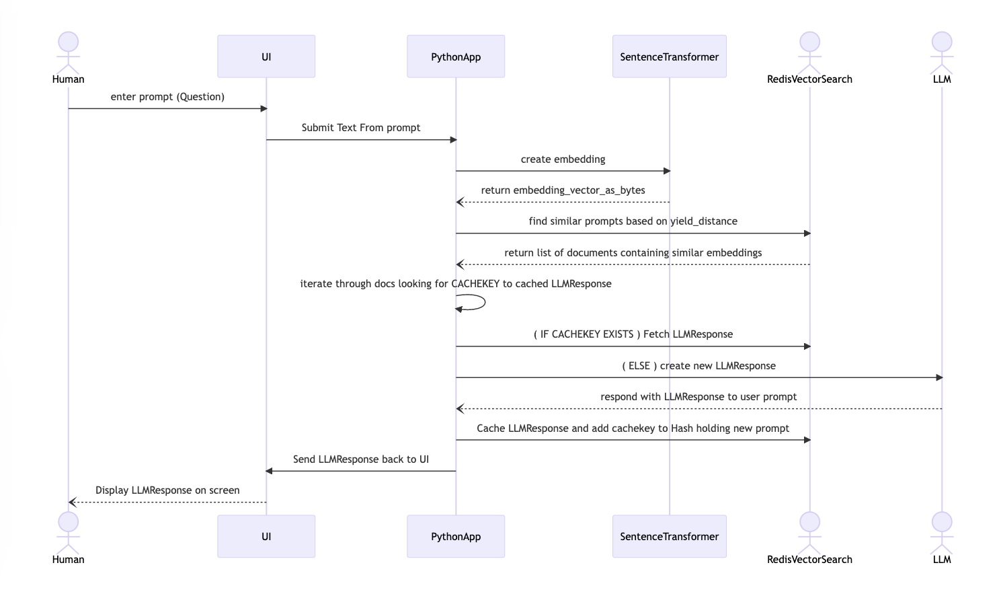

This project has several examples of using Redis, RediSearch + VSS and LLM technologies with Python

useful link to python docs for redis:
https://redis.readthedocs.io/en/stable/redismodules.html 

useful links for redisvl:
https://github.com/RedisVentures/redisvl/tree/main 
https://github.com/RedisVentures/redisvl 

SETUP:

1. Create a virtual environment:

```
python3 -m venv redisvl
```

2. Activate it:  [This step is repeated anytime you want this venv back]

```
source redisvl/bin/activate
```

On windows you would do:

```
venv\Scripts\activate
```

3. Python will utilize this requirements.txt in the project:

```
redis>=4.3.4
redisvl>=0.0.3
```

4. Run: [this step is repeated anytime you want this venv]

```
pip3 install -r requirements.txt
```

5. Execute the redisvl_1.py code (or another example) from the project directory:

#### You should probably run with all the available options enabled the first time you run the program

```
python3 redisvl_1.py -h redis-10400.homelab.local -p 10400 -c y -l y -t y
```

#### but no need to recreate the index, or load more data if you don't want to, for consecutive runs


* This example run -t tries just a Search Query:

```
python3 redisvl_1.py -h redis-10400.homelab.local -p 10400 -t y
```

* This example run -l loads data into Redis and then -t tries the query:  
(note that if you run this program more than once with the -l argument the data will grow in size and query results will shift)

```
python3 redisvl_1.py -h redis-10400.homelab.local -p 10400 -l y -t y
```

* This example run -c creates a new Search Index and then -t tries the query:

```
python3 redisvl_1.py -h redis-10400.homelab.local -p 10400 -c y -t y
```


6. If you get errors it is most likely because you haven't configured the host and port to your redis server

7. If you get no results from your query - try again  - the program flips a coin and is more generous with the results every other time - also, you can make more data for more results by running the program a few times with this argument/flag: 

```
-l y
``````

8. when you are done exploring this set of examples you can deactivate the virtual environment:

```
deactivate
```

#### Here is a sample run of redisvl_1.py with results:
``` 
(redisvl) owentaylor@Owens-MacBook-Pro hellovss % python3 redisvl_1.py -h redis-10400.homelab.local -p 10400 -c n -l y -t y
user_choice for -c == n
user_choice for -l == y
user_choice for -t == y

<class 'dict'>
search_schema loaded

connecting to: host=redis-10400.homelab.local port=10400 ...
loading data into redis...
Dummy Data created! - here is a sample of one of the elements and it's length:
b'\xcd\xccL>\xcd\xccL>\xe8\xb4\x01>'

12

Executing a test query against the redis search index...
        RESULT:


        ISSUING THIS QUERY: 
(@age:[40 +inf] @age:[-inf 45])=>[KNN 200 @user_embedding $vector AS vector_distance] RETURN 5 user age job credit_score vector_distance SORTBY vector_distance ASC DIALECT 2 LIMIT 0 200


Query Results have a length of 2

RESULT:
 {'id': 'users:0e4b96bcf8d64eb5a5b4f9bbd30bd89d', 'vector_distance': '0.177916705608', 'user': 'joe', 'age': '40', 'job': 'dentist', 'credit_score': 'medium'}

RESULT:
 {'id': 'users:aa04263d6a7a4c1b8c6e11618d64c920', 'vector_distance': '0.311962246895', 'user': 'mary', 'age': '45', 'job': 'doctor', 'credit_score': 'low'}


exiting ...
```

#### Another example uses streamlit to provide a browser-based UI


The example: localStreamlitChat.py showcases the following flow where:
* user submits prompt text
* script uses huggingFace library to create embedding of prompt
* script stores embedding in RedisVSS as part of a Hash object 
* RedisVSS adds the Hash object to its search index
* script searches RedisVSS for similar prompts and their responses
* if similar prompt and cached response exists, the cached response is sent to UI/User
* if no cached response exists, script calls LLM to generate new one
* new response is cached in Redis along with prompt
* new response is sent to user via UI



To start this example you will need to download and remember the path to a LLM model binary to your local machine - the default one (the one in the code) is: 

ggml-model-gpt4all-falcon-q4_0.bin

Which is around 4 GB in size, requires 8GB of RAM, and can be downloaded from huggingface:

https://huggingface.co/nomic-ai/gpt4all-falcon-ggml/tree/main 

Another option which I find produces slower, less predictable results due to it being more 'social' and inclined to repond as a chat or long text with emojis is:

llama-2-7b-chat.ggmlv3.q4_0.bin

Which is a few GB in size, also requires 8GB of ram and can be downloaded from gpt4all:

https://gpt4all.io/index.html

Once you have downloaded one of the generative models above, edit the code in localStreamlitChat.py around line 70 to point to the path on your system that holds the binary file for that model.

NB: The template code for the model which guides it as to how to respond, may need tweaking if you use llama-2-7b-chat.ggmlv3.q4_0.bin  A different template is provided (rename the variable name in your code to assign its value to the template to be used)

You will also need to ensure you are able to access an instance of Redis that includes the Vector Similarity Search Capable RediSearch 2.4 or better Redis module.

Either: 
1. Edit the code to use the connection information your environment requires to connect to Redis. This will make it so you do not need to pass arguments to the streamlit program

```
streamlit run localStreamlitChat.py 
```

2. Provide arguments to the runtime when you start it like this:

```
streamlit run localStreamlitChat.py e10mods.centralus.redisenterprise.cache.azure.net 10000 qMSEqDfGtQ2SiDgTbhKON8ORGtOqjuLqAfvInIaQB0Aot=
```

Note that the LLM model is lazy-loaded so that the cached response can come back quicky when the Vector Similarity search identifies a close enough answer in the cache to warrant using that instead of generating a new query.  

Below, you can see the falcon LLM generating an answer takes ~30 seconds, whereas the next query which is slighly different, but shares enough meaning that it uses the cache, takes only ~131 milliseconds to provide the response.

(Note that both executions require the SentenceTransformer to create the embedding for use as the argument to the VSS search.)

```
falcon_model_load: model size =  3872.59 MB / num tensors = 196

        Elapsed Time to respond to user prompt was: 29.491217664442956 seconds


Here is the type of the embedding object: <class 'numpy.ndarray'>
Index already exists

Found a match! -->
 Document {'id': 'prompt:Hwmnywlvscmmnlytrvlnpck?:3733', 'payload': None, 'knn_dist': '0.0159949660301', 'prompt:abbrev': 'Hwmnywlvscmmnlytrvlnpck?:3733', 'response': 'prompt:response:4'}

keyname of cached response: prompt:response:4

        Elapsed Time to respond to user prompt was: 0.13123149331659079 seconds
```